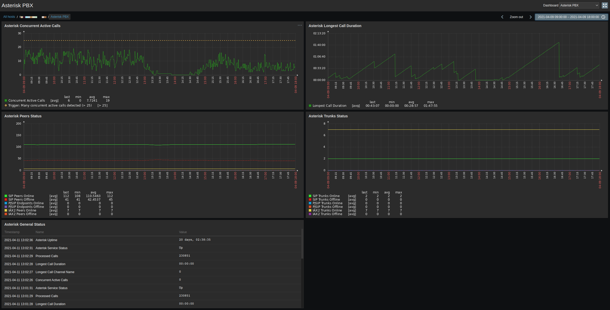
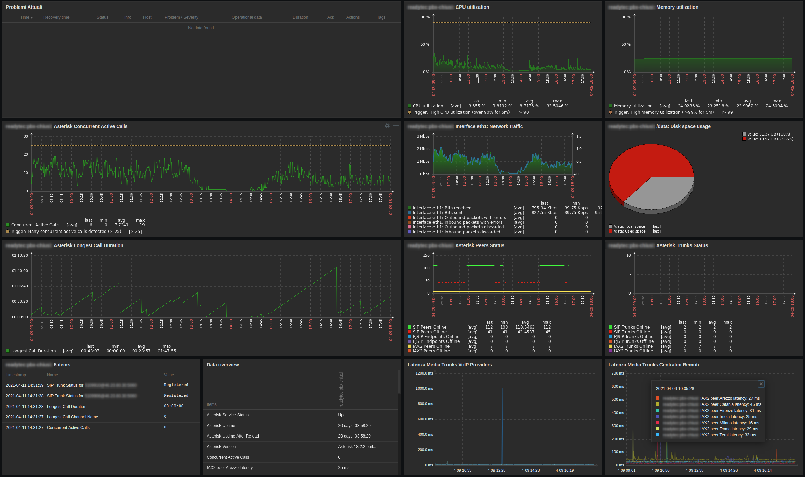

# Asterisk Zabbix Template
Check Asterisk PBX engine using Zabbix Network Monitoring system





## Features
- Easy installation and fast configuration (pure bash script without extra dependencies to install)
- Single script for discovery and checks
- Zabbix Agent based checks
- Caching of data to avoid high number of requests on asterisk engine (by default cache is valid for 60sec)
- Automatic discovery, monitoring and triggers generation for PJSIP, SIP and IAX Trunks
- Automatic discovery, monitoring and triggers generation for PJSIP, SIP and IAX Peers/Endpoints  
  (discovery of peers is enabled but items data collection is disabled by default to avoid high numbers of triggers. Selectively enable by hand the peers you want to monitor)
- Monitoring of active calls
- Monitoring of processed calls
- Monitoring of stucked calls
- Monitoring of last reload time
- Monitoring of uptime asterisk core
- Monitoring of asterisk version
- Monitoring of pjsip online/offline endpoints and registrations
- Monitoring of sip/iax2 online/offline peers and registrations
- Graphical dashboard with useful Asterisk data:
  - Asterisk Concurrent Active Calls Graph
  - Asterisk Longest Call Duration
  - Asterisk Peers Online/Offline Status count
  - Asterisk Trunks Online/Offline Status count
- Triggers for:
  - Max active concurrent calls
  - Call max duration time
  - Asterisk service problems
  - Asterisk restart
  - Asterisk reload
  - Asterisk version change
  - Trunks registrations problems
  - IAX2/SIP/PJSIP Peers/Endpoints unreachable
  - IAX2/SIP/PJSIP Peers/Endpoints high latency

## Installation for Zabbix Agent 1
- `mkdir -p /etc/zabbix/zabbix_agent2.d/scripts/`
- `cp zabbix_agent2.d/scripts/asterisk.sh /etc/zabbix/zabbix_agent2.d/scripts/asterisk.sh`
- `chmod 755 /etc/zabbix/zabbix_agent2.d/scripts/asterisk.sh`
- `cp zabbix_agent2.d/asterisk.conf /etc/zabbix/zabbix_agent2.d/asterisk.conf`
- Edit **sudoers** using `visudo` command and add:
```
User_Alias ZABBIX = zabbix
Cmnd_Alias ZABBIX_COMMANDS = /usr/sbin/asterisk
Defaults:ZABBIX !requiretty
ZABBIX ALL=(ALL) NOPASSWD: ZABBIX_COMMANDS
```
- Restart zabbix-agent: `systemctl restart zabbix-agent `
- Import `Asterisk-zbx_export_templates.xml` into Zabbix templates panel
- Assign Zabbix template to the Asterisk Host and wait automatic discovery

## Installation for Zabbix Agent 2
For **zabbix-agent2** the default configuration dir is `/etc/zabbix/zabbix_agent2.d`. Replace the path in the above commands to install

## Template Macros available
- `{$ASTERISK_CALLS_DURATION_WARN}`: Alarm when reaching call duration time (default: 7200 seconds)
- `{$ASTERISK_CALLS_ACTIVE_WARN}`: Alarm when reaching max active calls threshold (default: 20 calls)
- `{$ASTERISK_PEER_LATENCY_WARN}`: Alarm when a peer have high latency (ms)

## Troubleshooting
If your Zabbix Agent installation doesn't include the ` /etc/zabbix/zabbix_agent2.d/*.conf` directory, add the following lines to `/etc/zabbix/zabbix_agent2.conf` file:

```
Include=/etc/zabbix/zabbix_agent2.d/*.conf
```
## BUGS
Counting SIP/PJSIP/IAX2 Trunks is not reliable right now, works only if in the trunk name is alphanumeric (contains letters and number in the name)
ex. trunk name 511123 is not recognised. trunk name terra-511123 is recognised as trunk
