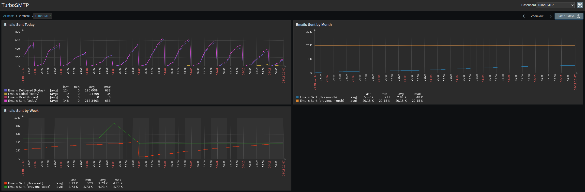

# TurboSMTP Template
Check TurboSMTP Mail Sending API service (https://www.serversmtp.com/it/)

## Features

### Items
- Emails Sent (this month)
- Emails Sent (previous month)
- Emails Sent (today)
- Emails Delivered (today)
- Emails Failed (today)
- Emails Read (today)
- Emails Sent (this week)
- Emails Sent (previous week)
- Emails Quota Limit (monthly)
- Sending IP Address
- Sending IP RBL Reputation
- Account Active Status

### Triggers
- Account status is not active
- Daily failed sent emails warning
- Hourly send rate threshold exceded
- Monthly sent emails quota warning
- Poor RBL reputation for sending IP

### Graphs
- Emails Sent Today
- Emails Sent by Week
- Emails Sent by Month

### Extra
- Command cache support

## Installation
- Shell commands prerequisites: curl, jq, dig
- `ZABBIX_SCRIPTS_DIR="/etc/zabbix/scripts"`
- `ZABBIX_AGENT_DIR="/etc/zabbix/zabbix_agent2.d"`
- `mkdir -p $ZABBIX_SCRIPTS_DIR $ZABBIX_AGENT_DIR`
- `cp scripts/turbosmtp.sh $ZABBIX_SCRIPTS_DIR/scripts/`
- `chmod 755 $ZABBIX_SCRIPTS_DIR/scripts/turbosmtp.sh`
- `cp turbosmtp.conf $ZABBIX_AGENT_DIR/`
- Restart zabbix-agent: `systemctl restart zabbix-agent2`
- Import `turbosmtp-zbx_export_templates.yaml` into Zabbix templates panel
- Assign Zabbix template to the host and customize the MACROS

## Template macros available
- `{$TURBOSMTP.USERNAME}`: Account Username (email address)
- `{$TURBOSMTP.PASSWORD}`: Account Password
- `{$TURBOSMTP.WARN.QUOTA}`: Max % of monthly sent mails against monthly mail quota
- `{$TURBOSMTP.WARN.FAILED}`: Max % of daily failed mails against daily sent mails
- `{$TURBOSMTP.THRESHOLD.HOURLY}`: Max hourly sending mail threshold
