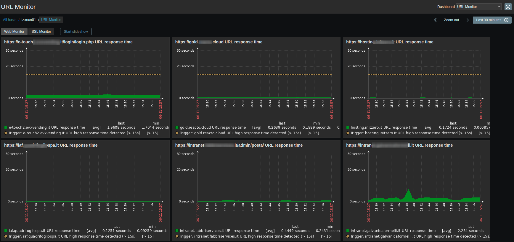
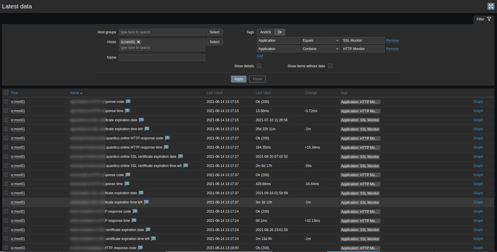

# Zabbix Template URL Monitor for HTTP Web Servers and SSL Certificates
This Zabbix template enables comprehensive monitoring of HTTP web server availability, response times, and SSL certificate expiration dates. It is designed to simplify the monitoring process by utilizing a straightforward Bash script, making it ideal for users of Zabbix server version 5.4 and above.




## Features
- Zabbix Agent based (developed and tested with Zabbix server >= 5.4)
- Simple Linux bash script based template
- Easy Intallation and Configuration
- LLD Discovery Items and Triggers based template
- Multiple URL monitoring using single CSV file as input for LLD (you can specify a local file path or a HTTP URL)
- Accounting of Expire Date and Time Left of the expiring SSL certificates
- 6 automatic types of trigger notifications (7 days left to expire, 3 days left to expire, certificate expired, http server unreachable, etc...)
- Configurable macros
- Automatic graphs and dashboard for response time metrics

### Items
- {#HOST} HTTP/S response code
- {#HOST} HTTP/S response message
- {#HOST} HTTP/S response time
- {#HOST} SSL certificate expiration date
- {#HOST} SSL certificate expiration time left

### Triggers
- {#HOST} HTTP/S server unreachable for {$URL_UNREACHABLE_TIME}
- {#HOST} HTTP/S bad response code from server
- {#HOST} HTTP/S server high response time detected (> {$URL_LATENCY_TIME})
- {#HOST} SSL certificate failed to retrieve
- {#HOST} SSL certificate will expire on {ITEM.VALUE1} (< {$URL_SSL_EXPIRE_TIME_WARNING})
- {#HOST} SSL certificate will expire on {ITEM.VALUE1} (< {$URL_SSL_EXPIRE_TIME_CRITICAL})
- {#HOST} SSL certificate has EXPIRED on {ITEM.VALUE1}

### Graphs
- {#URL} URL response time

## Installation
- External commands required to install before using this template: `openssl`, `curl`, `dos2unix`
- Install and configure the main script into zabbix agent client that will test the URLs:
```
git clone https://github.com/ugoviti/zabbix-templates.git
cd zabbix-templates/
git pull
cd url-monitor/
ZABBIX_SCRIPTS_DIR="/etc/zabbix/scripts"
ZABBIX_AGENT_DIR="/etc/zabbix/zabbix_agent2.d"
mkdir -p $ZABBIX_SCRIPTS_DIR $ZABBIX_AGENT_DIR
cp scripts/* $ZABBIX_SCRIPTS_DIR/
chmod 755 $ZABBIX_SCRIPTS_DIR/*
cp zabbix_agent*/*.conf $ZABBIX_AGENT_DIR/
```
- Change Timeout settings of Zabbix Agent config file `/etc/zabbix/zabbix_agent2.conf`: `Timeout=20` (default setting of 3 seconds is too small)
- Restart zabbix-agent: `systemctl restart zabbix-agent2`
- Import `url-monitor_zbx_export_templates.yaml` into Zabbix templates panel
- Assign Zabbix template to the host and customize the MACROS like`{$URL_PATH_CSV}` macro path with your CSV file and wait for automatic discovery

## CSV File template example
Default file path: `/etc/zabbix/url-monitor.csv`

Look inside the `url-monitor.csv` file for examples

### NOTES:
  1. by default if no port is specified will be used the port `443`
  2. by default if no schema is specified will be used the schema `https`
  3. `http://www.wearequantico.it` or `http://www.wearequantico.it:80` or `www.wearequantico.it:80` are the same
  4. `https://www.wearequantico.it` or `https://www.wearequantico.it:443` or `www.wearequantico.it` or `www.wearequantico.it:443` are the same
  5. to monitor SSL certificates expire dates for other (NON HTTPS) services like SMTP, IMAP etc , you can use the `tcp://` schema
  6. if the `tcp://` schema is specified, the HTTP check will be disabled and HTTP response code will be always 200 (only certificate check will be monitored)


## Template macros available
- `{$URL_PATH_CSV}`: CSV file path or url of domains list (default: `/etc/zabbix/url-monitor.csv`. Example for remote file download: `http://yourserver.local/yourfile.csv`)
- `{$URL_UNREACHABLE_TIME}`: Critical timeout due to unreachable URL (minutes) (default: `10m`)
- `{$URL_LATENCY_TIME}`: Default acceptable latency for loading URL (seconds) (default: `15s`)
- `{$URL_SSL_EXPIRE_TIME_WARNING}`: Warning level for SSL certificate expiration time (days) (default: `7d`)
- `{$URL_SSL_EXPIRE_TIME_CRITICAL}`: Critical level for SSL certificate expiration time (days) (default: `3d`)
- `{$URL_SSL_ALLOW_EXPIRED}`: Allow expired SSL certificates (no warnings on expired certs) (you can override this using CSV file options)
- `{$URL_SSL_ALLOW_INVALID}` Allow invalid or self signed SSL certificates (you can override this using CSV file options)

## Troubleshooting
- If Zabbix can't parse the CSV file, test JSON output from the CLI:
  - `/etc/zabbix/scripts/url-monitor.sh url.discovery /etc/zabbix/url-monitor.csv`
- Test the output and if the script works as expected from the CLI:
  - `/etc/zabbix/scripts/url-monitor.sh url.monitor https://www.wearequantico.it`
